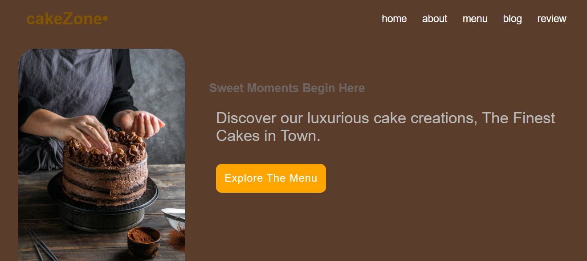
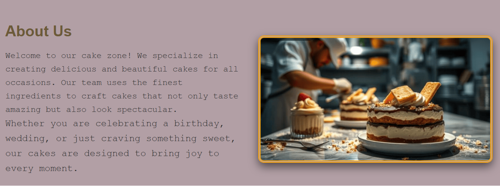
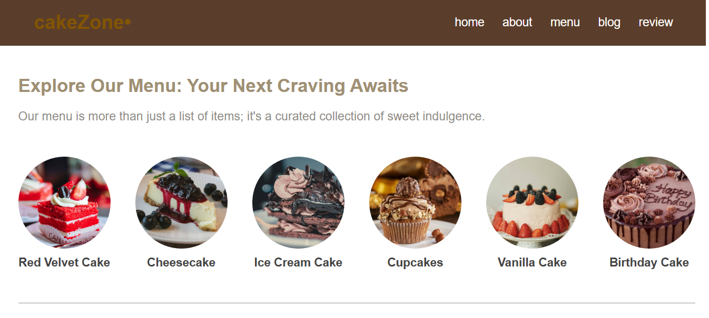
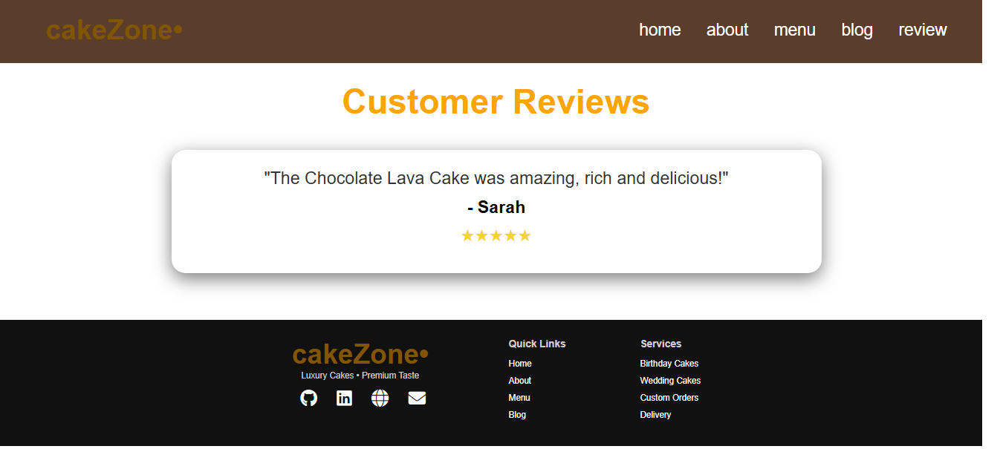

# Cakezone Website 

A modern, responsive web  for a fictional cake shop. The goal of this  is to provide a seamless and attractive user experience for showcasing various cake products.

## Key Features

*   **Responsive Design:** Works efficiently on smartphones, tablets, and desktop computers using Media Queries and Flexbox.
*   **Product Sections:** Organized display of different cake categories with interactive hover effects.
*   **Interactive Slider:** For showcasing customer reviews or featured products.
*   **Fixed Navbar:** Ensures easy navigation and access to different sections at all times.
*   **Attractive UI:** Utilizes cohesive fonts and color schemes (brown and orange).
*   **CSS Effects:** Uses smooth transitions and `transform: scale()` movements to create a lively interface.

## Technologies Used

*   `HTML5`: For building the page structure.
*   `CSS3`: For styling, presentation, and full responsiveness (Responsive Design).
*   `JavaScript`: For adding interactivity (e.g., the mobile menu toggle functionality).
*   Google Fonts: Integration of custom fonts like "Josefin Sans" and "Poppins".

## How to Get Started (Running Locally)

1.  **Clone the repository:**
    Open your terminal or command prompt and run the following command:
    ```bash
    git clone github.com
    ```

2.  **Navigate to the project folder:**
    ```bash
    cd your-repository-name
    ```

3.  **Open `index.html`:**
    Simply open the `index.html` file located inside the folder in your preferred web browser.

## Screenshot







## Live Demo
https://nagwa-lu.github.io/Cake-Shop-Responsive-/

